# EASYバインダーPWA

日々の業務でSaleseforceやKintoneのようなツールに入力する文面や、メールの定型文などを少しでも楽に作成するためのテンプレート機能を提供するWebアプリです。テキストをクリップボートへコピーしてから貼り付けるタイプです。

Googleの[Firebaseホスティング](https://firebase.google.com/products/hosting)で公開しています　→　https://easy-binder.web.app/

サンプルのテンプレート設定データは[こちら](https://easy-binder.web.app/template.json)です。

Webフォントを採用しWindowsでもMacでも同じフォントで表示。レスポンシブ・デザインを導入し、幅広いデバイスに対応。PWA（**Progressive web apps**）となっており、ブラウザにインストールしておけば、オフラインでも利用可能です。

  <a href="../../raw/master/figure01.webp">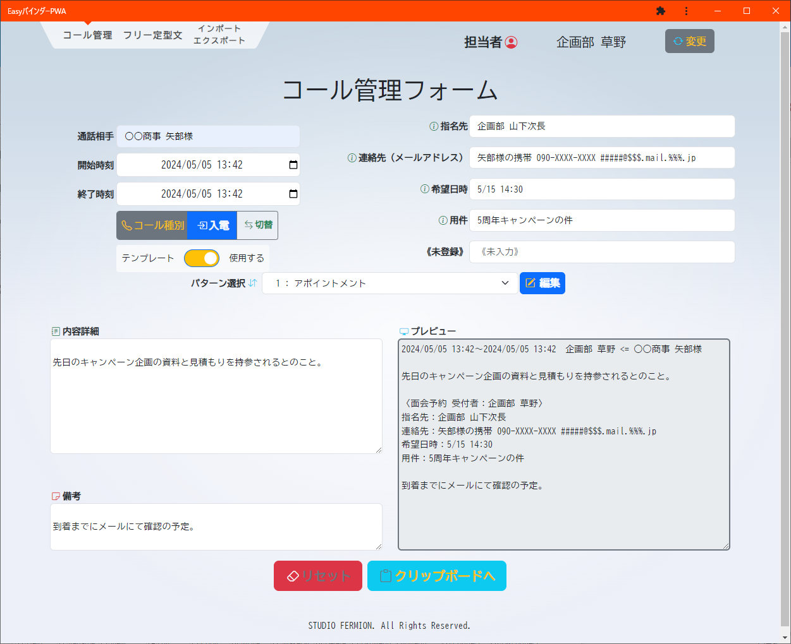</a>
  <a href="../../raw/master/figure02.webp">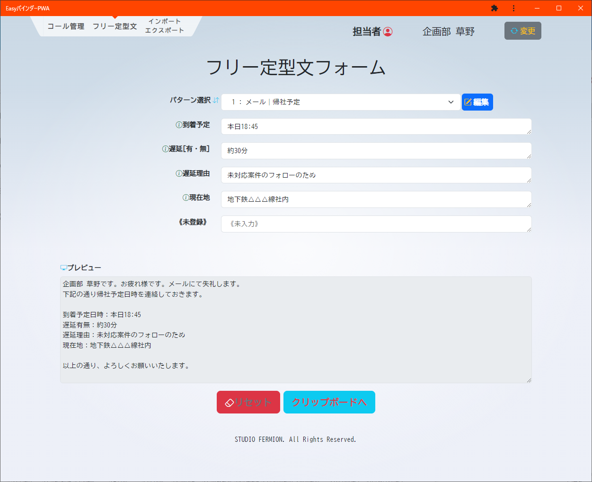</a>

  <a href="../../raw/master/figure03.webp">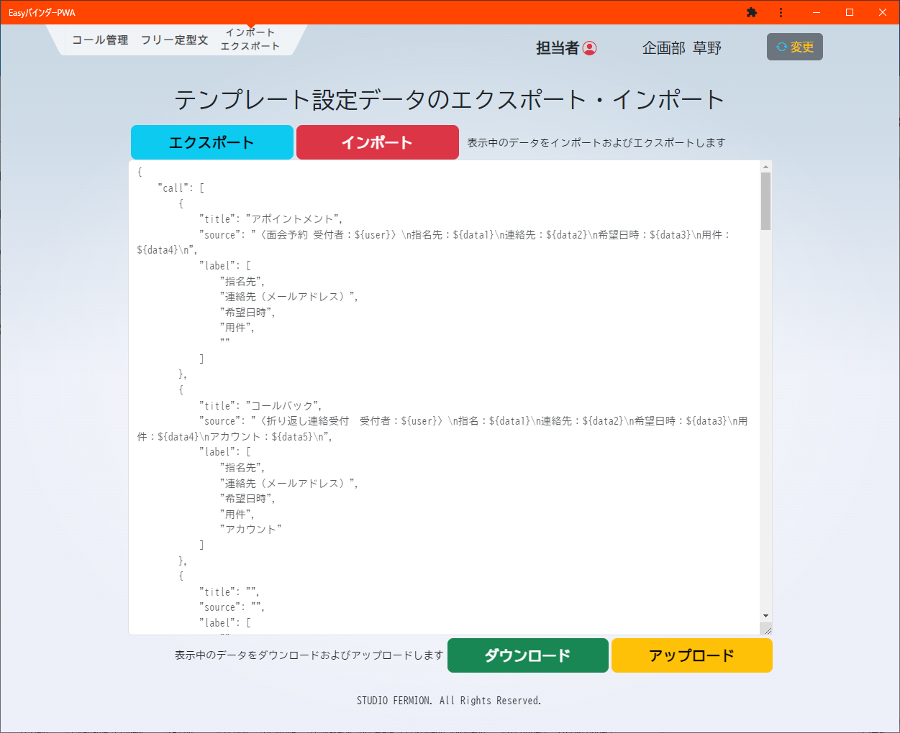
  <a href="../../raw/master/figure04.webp">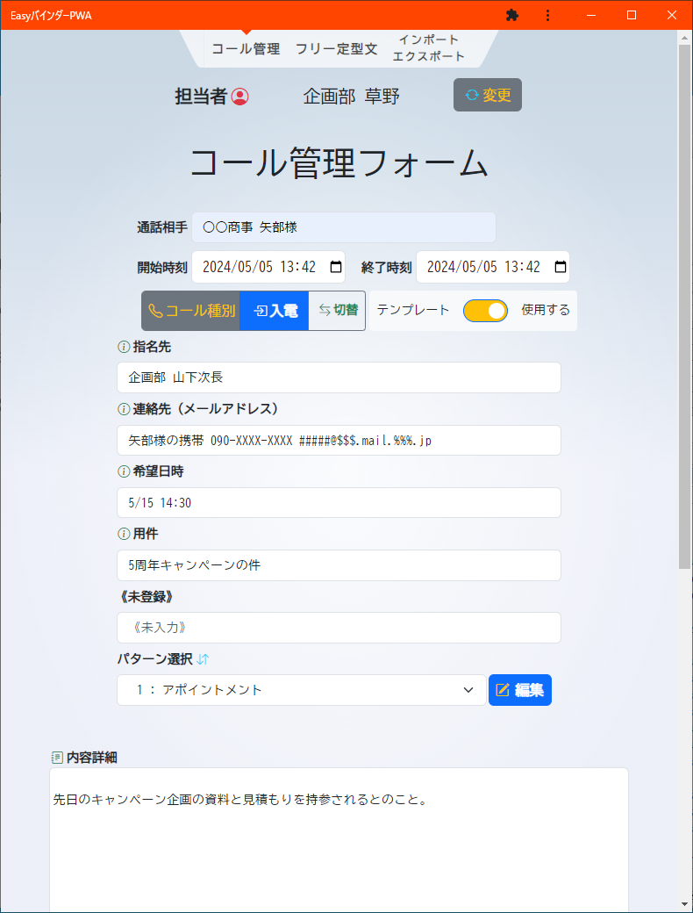
  <a href="../../raw/master/figure05.webp">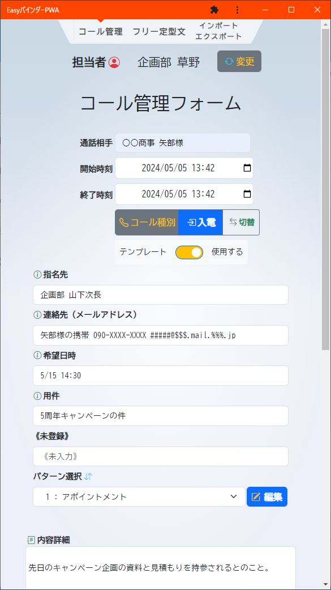

電話での対応履歴や、メールの定型文の作成を支援するためのテンプレート機能を備えたツールです。Webなのでクロスプラットフォームで利用できます。下記のような特長を備えています。

- Webアプリケーションフレームワーク[**SveltKit**](https://kit.svelte.jp/)により生成されたコードによって、高速にフロントエンド処理を実行し、軽快に動作。
- [Googleフォント](https://fonts.google.com/)より提供のWebフォントモリサワBIZ UDゴシックを使用し、WindowsでもMacでも同一のフォントで表示。
- [Bootstrap](https://getbootstrap.jp/)の導入によりレスポンシブデザインを実現、PC以外にも多様なデバイスに対応が可能。
- [PWA（**Progressive web apps**）](https://developer.mozilla.org/ja/docs/Web/Progressive_web_apps)としてインストール可能となっており、オフラインでも利用可能。

### ブラウザへのインストール

各ブラウザへのインストールの開始方法です。

*Google Chrome*
[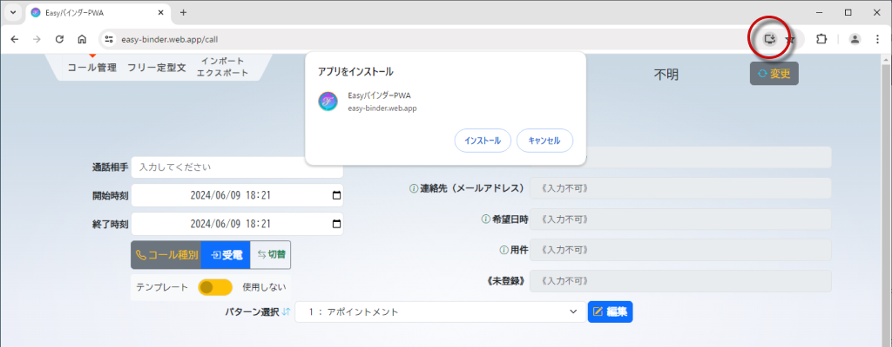](../../raw/master/figure06.webp)

*Microsoft Edge*
[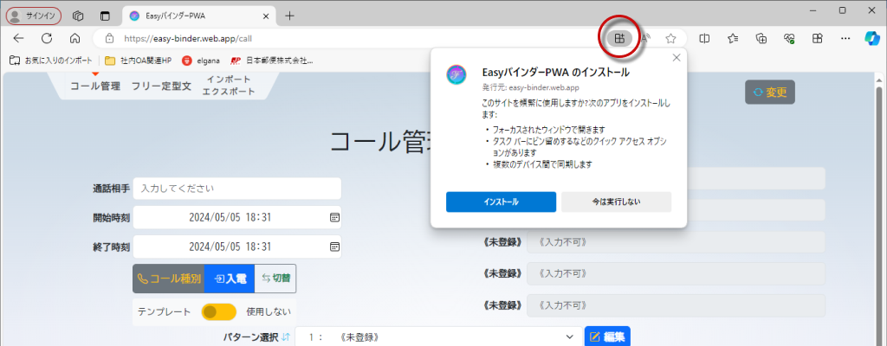](../../raw/master/figure07.webp)

*Vivaldi*
[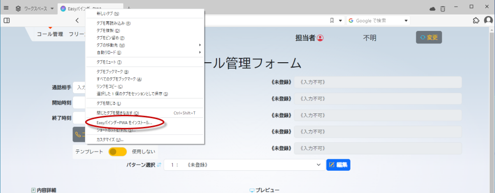](../../raw/master/figure08.webp)

### テンプレートの使用方法

テンプレート内に変数を配置しておくことにより、自動的に担当者名と置換することができます。

[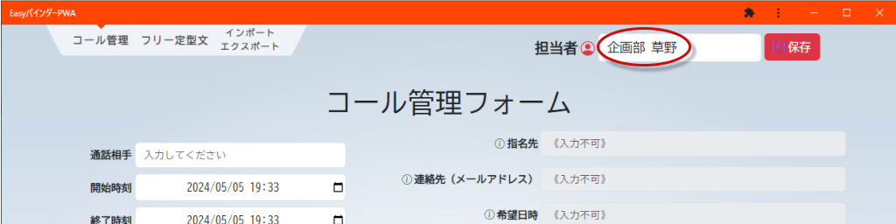](../../raw/master/figure09.webp)

テンプレートは10パターン作成可能。「編集」ボタンより設定を開始します。

[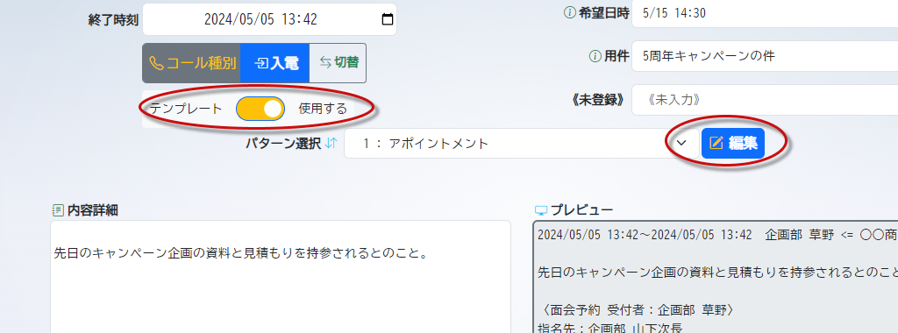](../../raw/master/figure10.webp)

テンプレートの設定では、任意の文字列と置換したい箇所に変数を記載しておくことにより、文字列を挿入する場所を確保しておけます。

[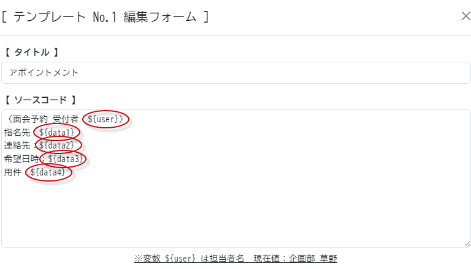](../../raw/master/figure11.webp)

それぞれの変数には、わかりやすいラベルをつけておくことができます。なお、変数名として定義されている文字列は、生成されるテキストデータには含めることができませんので、ご了承ください。

[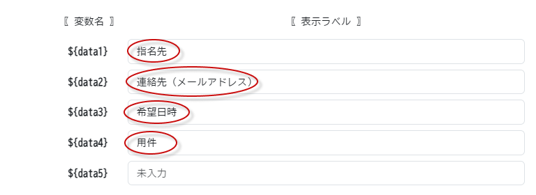](../../raw/master/figure12.webp)

生成されたテキストデータをクリップボードへコピーすると、念のためにログにも出力されます。

[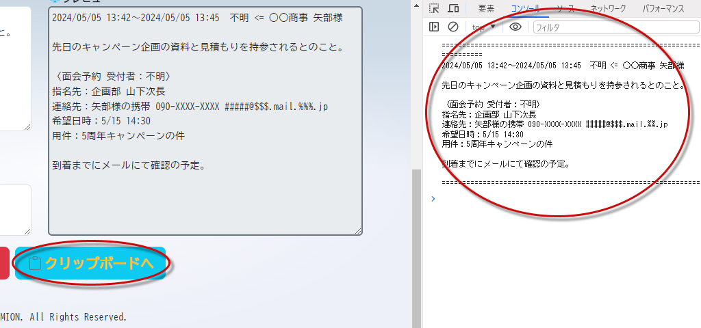](../../raw/master/figure13.webp)

### テンプレート設定データの管理

設定したテンプレートのデータは、エクスポートしてからクリップボートにコピー、またはファイルとしてダウンできます。

[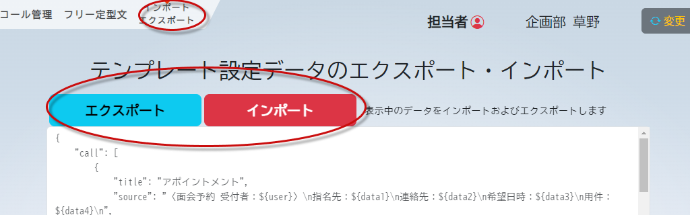](../../raw/master/figure14.webp)

また、エクスポートしたテンプレートのデータは、クリップボードから貼り付け、またはファイルをアップロードしてから、インポートすることができます。

[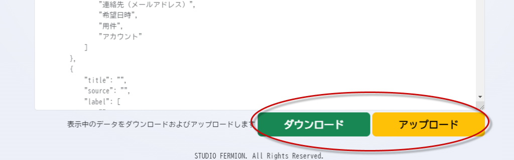](../../raw/master/figure15.webp)

